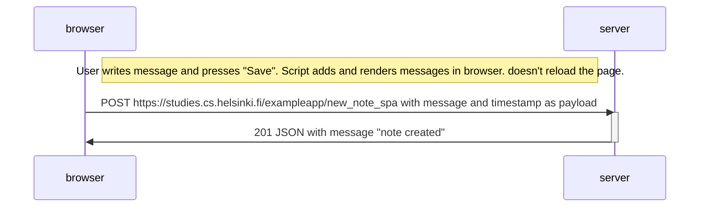

```mermaid
sequenceDiagram
    participant browser
    participant server

Note right of browser: User writes message and presses "Save". Script adds and renders messages in browser. doesn't reload the page.

    browser->>server: POST https://studies.cs.helsinki.fi/exampleapp/new_note_spa with message and timestamp as payload
    activate server
    server->>browser: 201 JSON with message "note created"
    deactivate server
```